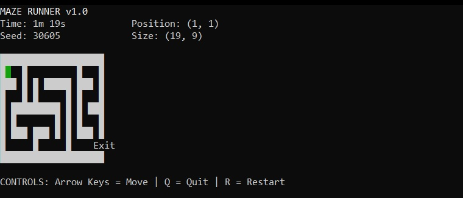
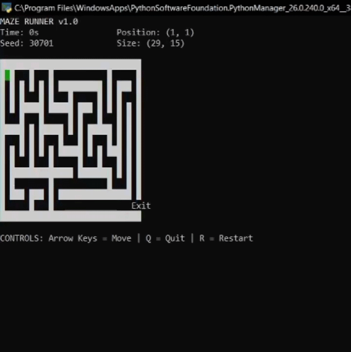

# Maze-Runner
Simple labyrinth game written in python using procedural generation

maze_runner/\
│\
├── maze_generator.py   # generates the maze\
├── main.py             # game\
└── lib/                # local libs

\
\
